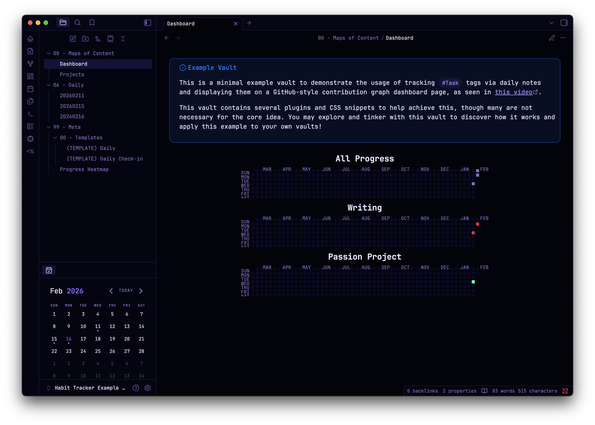

> [!IMPORTANT]  
> This README is a work in progress and will soon contain a complete writeup of the inner workings of the vault, including the detailed usage of each plugin and QoL features such as [Hotkeys for Templates](https://github.com/Vinzent03/obsidian-hotkeys-for-templates).

# (Example) Obsidian Habit Tracker Vault

This is an example Obsidian vault for visually tracking daily habits and project progress, serving as supplemental material for [this video](https://youtu.be/hdYzsdUZ9Jg) demonstrating that usage. A version of this concept will eventually be added into my [Vault Template](https://github.com/CyanVoxel/Obsidian-Vault-Template) repository.

